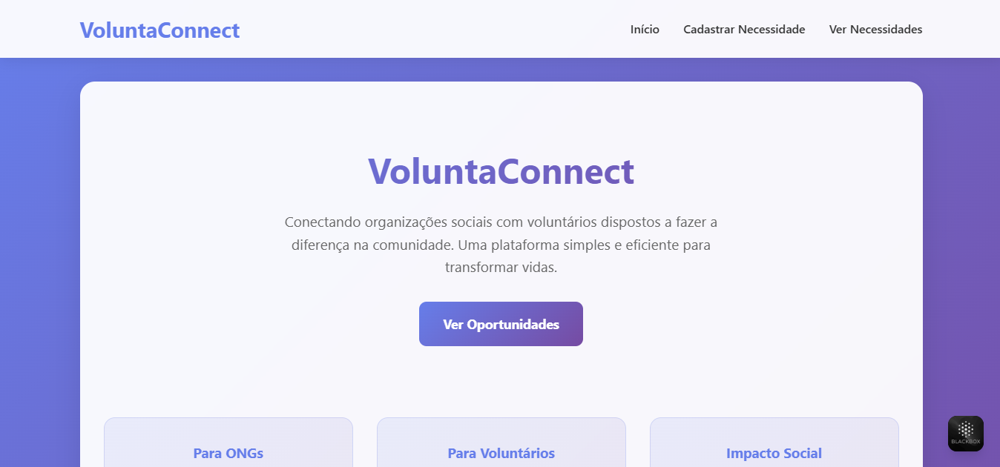
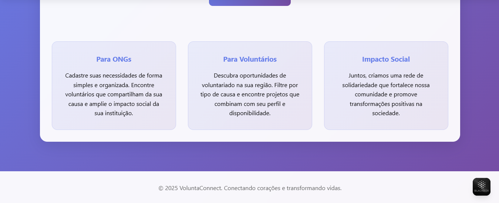
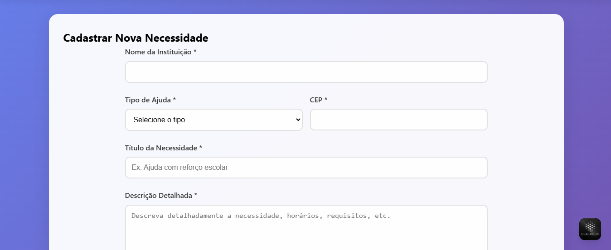
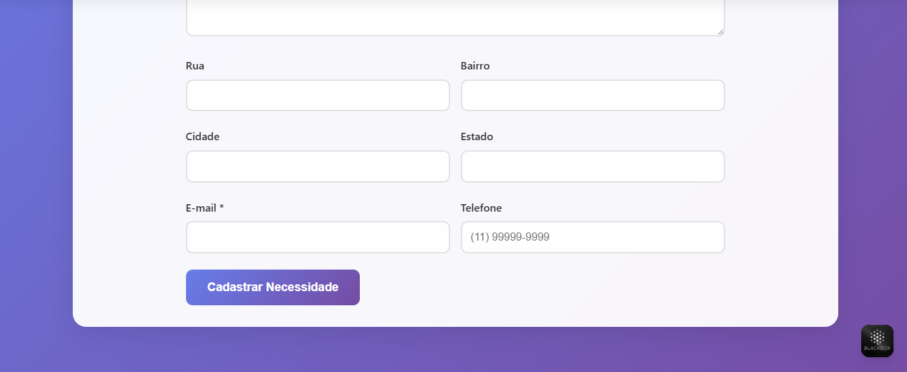
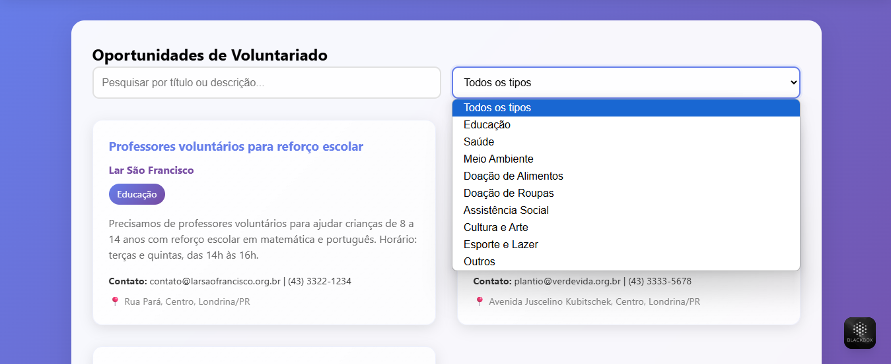
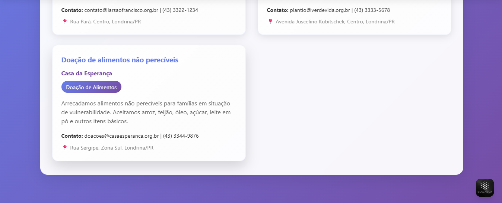

# 🌍 Plataforma de Conexão entre ONGs e Voluntários

Este projeto é uma aplicação web desenvolvida com HTML, CSS e JavaScript que tem como objetivo facilitar a conexão entre instituições sociais (ONGs) e voluntários interessados em ajudar.

## 📌 Motivação

Muitas ONGs enfrentam dificuldades para captar e organizar a participação de voluntários, principalmente por realizarem esse processo de forma manual e descentralizada. Esta plataforma foi idealizada para resolver esse problema, proporcionando:

- Maior **eficiência** na divulgação das necessidades;
- **Transparência** no processo de captação;
- **Acessibilidade** e **simplicidade** na navegação;
- Um **impacto social ampliado** através da tecnologia.

## 🚀 Funcionalidades

### 1. Estrutura e Navegação (HTML/CSS)

- **Página Inicial**: Apresentação do propósito da plataforma.
- **Página de Cadastro de Necessidade**: Formulário para ONGs registrarem suas demandas.
- **Página de Visualização de Necessidades**: Voluntários podem visualizar e buscar oportunidades de ajuda.
- **Design Responsivo**: Compatível com desktops, tablets e smartphones.
- **Consistência Visual**: Layout padronizado com cabeçalho, rodapé, cores e tipografia uniformes.

### 2. Cadastro de Necessidades (HTML/JavaScript)

- **Campos do formulário**:
  - Nome da Instituição
  - Tipo de Ajuda (Educação, Saúde, Meio Ambiente, Doação de Alimentos, Doação de Roupas, Outros)
  - Título da Necessidade
  - Descrição Detalhada
  - CEP (com preenchimento automático do endereço via API do ViaCEP)
  - Endereço completo (Rua, Bairro, Cidade, Estado)
  - Contato (E-mail/Telefone)

- **Validação de Formulário**: Verificação de campos obrigatórios e formato dos dados.
- **API ViaCEP**: Preenchimento automático do endereço a partir do CEP.
- **Armazenamento Local**: As necessidades cadastradas são salvas em um array utilizando JavaScript.

### 3. Visualização de Necessidades (HTML/CSS/JavaScript)

- **Exibição Dinâmica**: As necessidades cadastradas são exibidas em tempo real.
- **Cards Informativos**: Cada necessidade é apresentada com destaque (Título, Tipo de Ajuda, Nome da Instituição).
- **Busca e Filtro**:
  - Campo de pesquisa por palavras-chave (Título ou Descrição).
  - Filtro por Tipo de Ajuda.

## 🛠 Tecnologias Utilizadas

- HTML5
- CSS3 (com design responsivo)
- JavaScript (ES6)
- API ViaCEP (https://viacep.com.br/)

---

## 📸 Imagem de Prévia








---

## 📸 Prévia do Projeto

(https://natieledpaula.github.io/projeto-voluntario/)

---

## 📂 Estrutura do Projeto

```
projeto-voluntariado/
├── index.html # Página inicial da plataforma, tela de cadastro e busca de oportunidades.
├── img/
|    └── preview.png # Imagem de pré-visualização.
├── assets/
|     ├── css/
│     |     └── style.css # Estilos globais e responsividade.
|     └── js/
│          └── script.js # Lógica do formulário, validação e API ViaCEP, lógica de busca, filtros e exibição dinâmica.
└── README.md # Documentação do projeto
```

---

## 🧠 Aprendizados

Este projeto proporcionou aprendizados práticos em:

- Lógica de formulários e manipulação do DOM com JavaScript
- Consumo de APIs externas (ViaCEP)
- Design responsivo com CSS puro
- Armazenamento temporário em arrays (simulando um backend)
- Criação de filtros e buscas funcionais sem bibliotecas externas

---

## 📜 Licença

Este projeto está licenciado sob a **MIT License**.  
Você pode utilizá-lo, adaptá-lo e distribuí-lo livremente, com os devidos créditos.

---

## 👩‍💻 Desenvolvido por

**Natiele de Paula**  
🔗 GitHub: [@natieledpaula](https://github.com/natieledpaula)

---

> “Conectar quem quer ajudar com quem precisa é uma ponte que a tecnologia pode construir.” 🌍💙